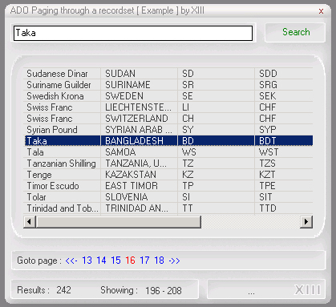



## Recordset Paging  in Visual Basic \!\!\!

### Description

ADO Recordset Paging in VISUAL BASIC !!!

There are many code samples that making recordset paging available in ASP ( Web based ). This example of ADO Paging through a recordset is written in Visual Basic !!!
 
### More Info
 

             |
---                |---
**Submitted On**   |2002-05-09 10:13:20
**By**             |[Alexander Kossovsky](https://github.com/Planet-Source-Code/PSCIndex/blob/master/ByAuthor/alexander-kossovsky.md)
**Level**          |Advanced
**User Rating**    |4.6 (74 globes from 16 users)
**Compatibility**  |VB 5\.0, VB 6\.0
**Category**       |[Databases/ Data Access/ DAO/ ADO](https://github.com/Planet-Source-Code/PSCIndex/blob/master/ByCategory/databases-data-access-dao-ado__1-6.md)
**World**          |[Visual Basic](https://github.com/Planet-Source-Code/PSCIndex/blob/master/ByWorld/visual-basic.md)
**Archive File**   |[ADO\_Paging81042592002\.zip](https://github.com/Planet-Source-Code/alexander-kossovsky-recordset-paging-in-visual-basic__1-34599/archive/master.zip)

